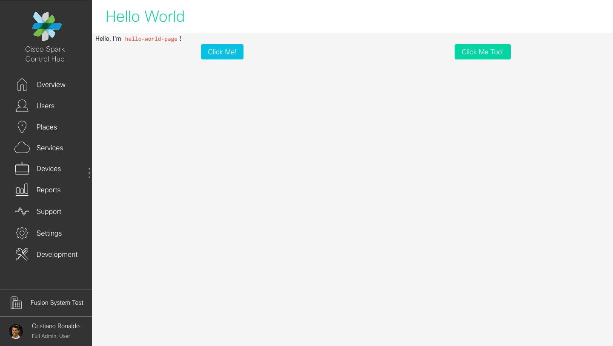
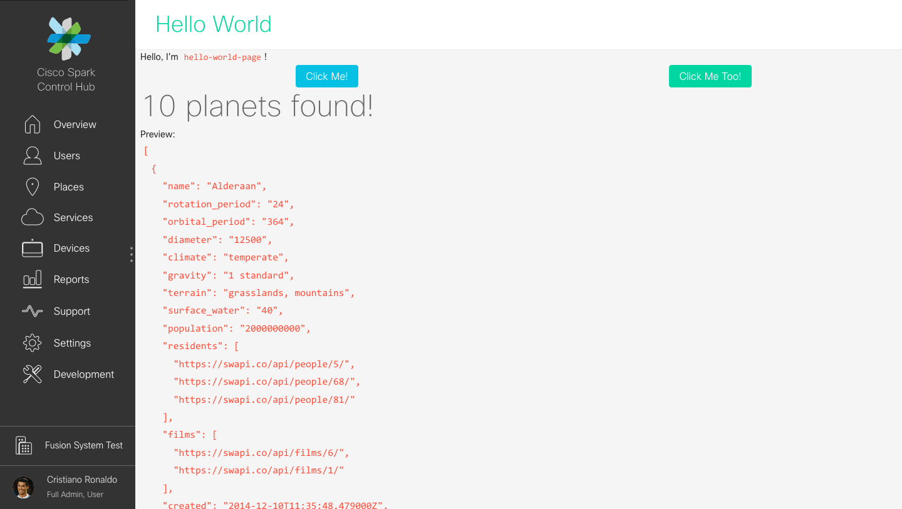

# Adding a simple page ("Hello World")

## New module

Unless you are adding a very simple new (sub-)page in the application, it's probably better to create a new module. Except for `core`, `shared` and `squared`, modules usually represent either a top page (and its sub-pages) of Control Hub (example: `app/modules/services-overview`) or a team/group of features (example: `app/modules/sunlight`).

Now, create a new module folder:

```bash
mkdir app/modules/hello-world
```

## First component

All new code introduced to Control Hub should use [AngularJS components](https://docs.angularjs.org/guide/component) (see also [Exploring the Angular 1.5 .component() method](https://toddmotto.com/exploring-the-angular-1-5-component-method/)).

Since creating new components may be a bit tedious and involves a lot of boilerplate, this repo contains a tool to help you: `mk-ng-component-skeleton.sh`.

Let's name our first page component `hello-world-page`:
```
./bin/mk-ng-component-skeleton.sh ./app/modules/hello-world/hello-world-page
```

If you look inside `./app/modules/hello-world/hello-world-page/index.ts` you will see that the generated module name is `hello-world.hello-world-page`:

```javascript
...
export default angular.module('hello-world.hello-world-page', [
...
```

Before forgetting, we need to somehow tell AngularJS that this module is part of the dependencies for our main application module: `wx2AdminWebClientApp` (it is used in `./app/index.html` and declared in `./app/scripts/app.js`). This happens in `./app/scripts/main.js`.

Define a new module:
```javascript
angular.module('HelloWorld', [
  require('modules/hello-world/hello-world-page').default,
]);

module.exports = angular.module('Main', [
...
```

And add it as a dependency to `'Main'`:
```javascript
...
  'HelloWorld',
]).config(require('./main.config'))
  .run(require('./main.run'))
  .name;
```

## Display the new component when visiting a specific URL

### Map an URL to a component

Matching URLs to components/code happens in `./app/scripts/appconfig.js`. For now, we use `angular-ui-router` 0.3.x, but hopefully we will update to the version 1.x in the near future (and this guide will have to be updated).

Chain a new `.state(…)` entry near the bottom of the file:
```javascript
$stateProvider
  .state('hello-world', {
    url: '/hello-world',
    parent: 'main',
    template: '<hello-world-page></hello-world-page>',
  });
```

### Define who can access this URL

By default all new URLs cannot be accessed by anyone. The authorization details are configured in `./app/modules/core/config/config.ts`.

Most likely, only admins with a certain role or orgs with a certain service/entitlement will have access to the new URL, it means that you need to modify `serviceStates`, `roleStates`, or both.

Let's authorize access to our new page only to admins with the role `Full_Admin`. You have to add `hello-world` to the array in the property `roleStates.Full_Admin`.

This time, the `hello-world` string represents the string we added as the first parameter of `$stateProvider.state()` in `./app/scripts/appconfig.js`.

### Put content in the component's template

Finally, modify `./app/modules/hello-world/hello-world-page/hello-world-page.html` so that we see something when loading the URL:

```html
<p>Hello, I'm <code>hello-world-page</code>!</p>
```

## Test your changes

Now, you can start the app using `yarn start` and then head to 127.0.0.1:8000/hello-world (don't forget that you need to log in with a `Full_Admin` user).


## Use components from the toolkit (and use the translation tool)

Let's make our page prettier by using components from [the Toolkit](http://collab-ui-ng.cisco.com) :)

Modify `./app/modules/hello-world/hello-world-page/hello-world-page.html`:

```html
<cs-page-header title-name="{{::'helloWorld.pageTitle' | translate}}"></cs-page-header>
<div class="row">
  <div class="columns large-12"><p translate="helloWorld.hello" translate-values="{name: 'hello-world-page'}"></p></div>
</div>
<div class="row">
  <div class="columns medium-6 center"><button type="button" class="button btn--primary" translate="helloWorld.clickMe"></button></div>
  <div class="columns medium-6 center"><button type="button" class="button btn--people" translate="helloWorld.clickMeToo"></button></div>
</div>
```

As you will notice, we use the `<cs-page-header/>` component from the Toolkit, as well as come CSS classes provided by the Toolkit too.

This code also uses various `translate*` directives to display text. Your HTML templates should never have text, and always rely on translation. Each string `helloWorld.***` should map to an entry in `./app/l10n/en_US.json`. This is what you should add at the end of the translation file to satisfy this HTML template:

```json
"helloWorld": {
  "pageTitle": "Hello World",
  "hello": "Hello, I'm <code>{{name}}</code>!",
  "clickMe": "Click Me!",
  "clickMeToo": "Click Me Too!"
}
```

The Toolkit provides already a lot of components and CSS classes. For now, we haven't modified `./app/modules/hello-world/hello-world-page/hello-world-page.scss` and we probably don't need too. If you find yourself adding dozens of new lines of (S)CSS code, either you are reinventing the wheel or the UX designer who provided your with mockups was too ambitious.



## Add a new AngularJS service

### Create the new file

Let's create a new AngularJS service that will get data from one of Atlas microservice. Except that since we won't create a new, fake, microservice, we will query a public API instead: https://swapi.co.

Create `./app/modules/hello-world/hello-world-page/hello-world.service.ts` with the following code:

```javascript
export interface ISQPlanetsResponse {
  count: number;
  next: string | null;
  prev: string | null;
  results: ISWPlanet[];
}

export interface ISWPlanet {
  climate: string;
  created: string;
  diameter: string;
  edited: string;
  films: string[];
  gravity: string;
  name: string;
  orbital_period: string;
  population: string;
  residents: string[];
  rotation_period: string;
  surface_water: string;
  terrain: string;
  url: string;
}

export class HelloWorldService {
  private baseURl = 'https://swapi.co/api';

  /* @ngInject */
  constructor(
    private $http: ng.IHttpService,
  ) {}

  public getSWPlanets(): ng.IPromise<ISWPlanet[]> {
    return this.$http.get<ISQPlanetsResponse>(`${this.baseURl}/planets`, {
      headers: {
        Authorization: undefined,
      },
      params: {
        format: 'json',
      },
    })
      .then(response => response.data.results);
  }
}

export default HelloWorldService;
```

We take advantage of types, that's one of the reason new code has to be written in TypeScript and not JavaScript directly.

### Update the CSP headers

Control Hub won't connect to `swapi.co` until we make some more modifications. The first one is to add the domain to the [CSP headers](https://developer.mozilla.org/en-US/docs/Web/HTTP/CSP). **You probably won't have to do that if the backend you are querying is hosted by Cisco.**

Edit `./config/csp-dev.config.js` to add the following line inside the `connectSrc` values:
```javascript
objectSrc: ["'none'"], // helmet-csp needs atleast one value for this directive
connectSrc: [
  'https://swapi.co', // Hello World, do not commit
  'http://127.0.0.1:8080', // Local Atlas Backend
```

* Do not forget to add a comment explaning what this endpoint is!
* If `yarn start` was running, it won't pick up this change (it works only for the appplication code, not the server running it locally) so you should kill the process and launch it again.
* For a proper Atlas microservice, you would rather have your new service rely on `UrlConfig`, defined in `./app/modules/core/config/urlConfig.js`.

Lastly, we need to modify `./app/modules/hello-world/hello-world-page/index.ts` to expose this service to AngularJS's dependency injector:
```javascript
...
import { HelloWorldPageComponent } from './hello-world-page.component';
import { HelloWorldService } from './hello-world.service'; // new line
import * as ngTranslateModuleName from 'angular-translate';
...
  .component('helloWorldPage', new HelloWorldPageComponent())
  .service('HelloWorldService', HelloWorldService) // new line
  .name;
```

## Use the new service

### Update the component's controller

The controller file (`./app/modules/hello-world/hello-world-page/hello-world-page.component.ts`) is almost empty, replace it by the following code.

```javascript
import { Notification } from 'modules/core/notifications';
import { ISWPlanet, HelloWorldService } from './hello-world.service';

export class HelloWorldPageController implements ng.IComponentController {
  public planets: ISWPlanet[] = [];
  public loading = false;

  /* @ngInject */
  constructor(
    private HelloWorldService: HelloWorldService,
    private Notification: Notification,
  ) {}

  public loadPlanets(): void {
    this.loading = true;
    this.HelloWorldService.getSWPlanets()
      .then(planets => {
        this.planets = planets;
      })
      .catch(error => this.Notification.errorWithTrackingId(error))
      .finally(() => {
        this.loading = false;
      });
  }
}

export class HelloWorldPageComponent implements ng.IComponentOptions {
  public controller = HelloWorldPageController;
  public template = require('./hello-world-page.html');
  public bindings = {};
}
```

Method like implement `loadPlanets()` should be pretty common in your components:
* Manipulate a `loading` property that will be reused in the template.
* Use promises chaining.
* Display a notification when an error happens.

### Add code to the component template

Keep the existing code in the component template (`./app/modules/hello-world/hello-world-page/hello-world-page.html`) and add the following lines.

```html
<div class="row" ng-if="$ctrl.loading">
  <div class="columns large-12 center">
    <span class="spinner-example--large">
      <i class="icon icon-spinner"></i>
    </span>
  </div>
</div>
<div class="row" ng-if="!$ctrl.loading && $ctrl.planets.length > 0">
  <div class="columns large-12">
    <h1 translate="helloWorld.planetsFound" translate-value-count="{{$ctrl.planets.length}}" translate-interpolation="messageformat"></h1>
    <p translate="helloWorld.preview"></p>
    <pre><code>{{$ctrl.planets | json}}</code></pre>
  </div>
</div>
```

Here we extensively use the grid CSS classes from the toolkit and util classes like `center`. There is also an example of using plurals in translations.

After the component has been initiliazed, nothing more will be displayed. A spinner will appear when the `loading` property is truthy and when loading stops, if `planets` is has items, we will display the raw data (using components from the toolkit to display planets in a pretty way is left as an exercise to the reader).

The only thing missing for this step, is to modify the first button to actually call the `loadPlanets()` button:
```html
<!-- This line -->
<div class="columns medium-6 center"><button type="button" class="button btn--primary" translate="helloWorld.clickMe"></button></div>
<!-- Becomes -->
<div class="columns medium-6 center"><button cs-btn loading="$ctrl.loading" type="button" class="button btn--primary" ng-click="$ctrl.loadPlanets()"><span translate="helloWorld.clickMe"></span></button></div>
```

You should notice two things:
* We added `cs-btn loading="$ctrl.loading"` to `<button>` in order to make is show a loading animation **and** make it not clickable when the service is loading data, thus preventing accidental extra requests.
* We had to add a `<span>` inside `<button>` for the translation, because the `cs-btn` and `translate` directives do not work on the same element.



## Test the new service and component

### Testing the service

Create a new file in the same folder as the service you are testing, adding `.spec.` to its name: `./app/modules/hello-world/hello-world-page/hello-world.service.spec.ts`.

```javascript
import moduleName from './index';
import { HelloWorldService, ISQPlanetsResponse } from './hello-world.service';

type Test = atlas.test.IServiceTest<{
  HelloWorldService: HelloWorldService,
}>;

const fakeResponse: ISQPlanetsResponse = {
  count: 1,
  next: null,
  prev: null,
  results: [{
    name: 'Alderaan',
    rotation_period: '24',
    orbital_period: '364',
    diameter: '12500',
    climate: 'temperate',
    gravity: '1 standard',
    terrain: 'grasslands, mountains',
    surface_water: '40',
    population: '2000000000',
    residents: [
      'https://swapi.co/api/people/5/',
      'https://swapi.co/api/people/68/',
      'https://swapi.co/api/people/81/',
    ],
    films: [
      'https://swapi.co/api/films/6/',
      'https://swapi.co/api/films/1/',
    ],
    created: '2014-12-10T11:35:48.479000Z',
    edited: '2014-12-20T20:58:18.420000Z',
    url: 'https://swapi.co/api/planets/2/',
  }],
};

describe('Service: HelloWorldService', () => {
  beforeEach(function (this: Test) {
    this.initModules(moduleName);
    this.injectDependencies(
      'HelloWorldService',
    );
    // Following line necessary to use expect(…).toBeResolved*() or expect(…).toBeRejected*()
    installPromiseMatchers();
  });

  afterEach(function (this: Test) {
    this.$httpBackend.verifyNoOutstandingExpectation();
    this.$httpBackend.verifyNoOutstandingRequest();
  });

  describe('getPlanets()', () => {
    it('should call the right backend', function (this: Test) {
      this.$httpBackend.expectGET('https://swapi.co/api/planets?format=json').respond(200, fakeResponse);
      expect(this.HelloWorldService.getSWPlanets()).toBeResolvedWith(fakeResponse.results);
    });
  });
});
```

Since we made all of our code modular, you can run (and watch) the test using:

```shell
KTEST__MODULAR=true yarn ktest-watch ./app/modules/hello-world/hello-world-page/hello-world.service.spec.ts
```

Notes:
* Properly using `atlas.test.IServiceTest<>` and `function (this: Test) {}` allows us to make the most out of TypeScript types.
* When creating a fake response from an HTTP response, if too long better store is in a JSON file inside `./test/fixtures` and load the date using `getJSONFixture()`.
* For this simple service, there isn't much to test expect calling the right backend (with the right GET parameters) and testing that the method we are calling are returning only what we are looking for from the JSON response.

### Testing the component

The test file for the component already exists: `./app/modules/hello-world/hello-world-page/hello-world-page.component.spec.ts`.

Replace it with:

```javascript
import moduleName from './index';
import { HelloWorldPageController } from './hello-world-page.component';
import { Notification } from 'modules/core/notifications';
import HelloWorldService from './hello-world.service';

type Test = atlas.test.IComponentTest<HelloWorldPageController, {
  HelloWorldService: HelloWorldService,
  Notification: Notification,
}, {}>;

describe('Component: helloWorldPage:', () => {
  beforeEach(function (this: Test) {
    this.initModules(moduleName);
    this.injectDependencies(
      'HelloWorldService',
      'Notification',
    );
  });

  beforeEach(function (this: Test) {
    this.compileTemplate('<hello-world-page></hello-world-page>');
    this.compileComponent('helloWorldPage', {});
  });

  describe('primary behaviors (view):', () => {
    it('...', function (this: Test) {
      // TODO: implement
    });
  });

  describe('primary behaviors (controller):', () => {
    it('...', function (this: Test) {
      // TODO: implement
    });
  });
});
```

**Testing Resources**
* https://docs.angularjs.org/guide/unit-testing
* http://www.pluralsight.com/courses/play-by-play-angular-testing-papa-bell
* http://www.bradoncode.com/tutorials/angularjs-unit-testing/

<!--
## Add a link to the new page (and use feature toggles)

*TODO*

## Create a sub-component to use in our component page

*TODO*

## Add a component with bindings

*TODO*
-->
